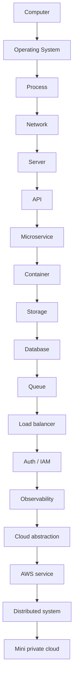

# 01 — Master arrow

The entire lab is one arrow: a request starts on a human device and ends as electrons in silicon.

```
Computer → OS → Process → Network → Server → API → Microservice → Container → Storage → Database → Queue → Load Balancer → Auth → Observability → Cloud → AWS → Distributed system → Mini private cloud
```


