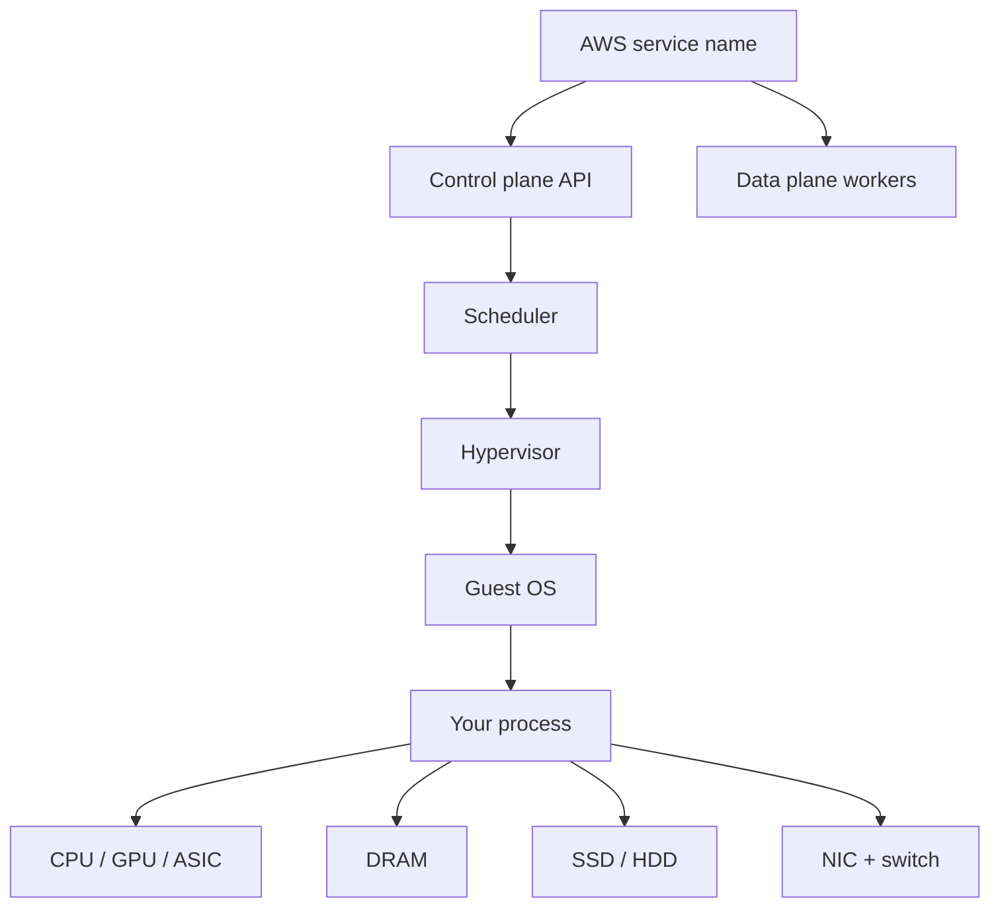

# 02 — Cloud to hardware

The cloud is rented computers plus software that hides the ugly parts.

```mermaid
flowchart TB
  SVC[AWS service name] --> CTRL[Control plane API]
  SVC --> DATA[Data plane workers]
  CTRL --> ORCH[Scheduler]
  ORCH --> HV[Hypervisor]
  HV --> GUEST[Guest OS]
  GUEST --> PROC[Your process]
  PROC --> CPU[CPU / GPU / ASIC]
  PROC --> RAM[DRAM]
  PROC --> DISK[SSD / HDD]
  PROC --> NIC[NIC + switch]
```
