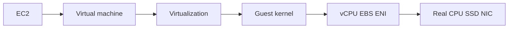
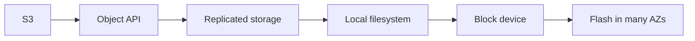
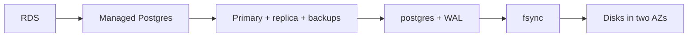
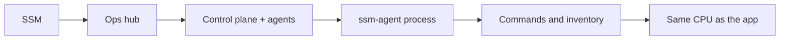

# 03 — Peel an AWS service

```
AWS Service → Cloud abstraction → Distributed-system concept → OS concept → Computer architecture → Physical hardware
```


```mermaid
flowchart LR
  A1[EC2] --> A2[Virtual machine]
  A2 --> A3[Virtualization]
  A3 --> A4[Guest kernel]
  A4 --> A5[vCPU EBS ENI]
  A5 --> A6[Real CPU SSD NIC]
```


```mermaid
flowchart LR
  B1[S3] --> B2[Object API]
  B2 --> B3[Replicated storage]
  B3 --> B4[Local filesystem]
  B4 --> B5[Block device]
  B5 --> B6[Flash in many AZs]
```


```mermaid
flowchart LR
  C1[RDS] --> C2[Managed Postgres]
  C2 --> C3[Primary + replica + backups]
  C3 --> C4[postgres + WAL]
  C4 --> C5[fsync]
  C5 --> C6[Disks in two AZs]
```


```mermaid
flowchart LR
  D1[SSM] --> D2[Ops hub]
  D2 --> D3[Control plane + agents]
  D3 --> D4[ssm-agent process]
  D4 --> D5[Commands and inventory]
  D5 --> D6[Same CPU as the app]
```
