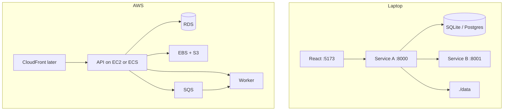

# 04 — Local vs AWS

```mermaid
flowchart TB
  subgraph local [Laptop]
    LF[React :5173] --> LA[Service A :8000]
    LA --> LD[(SQLite / Postgres)]
    LA --> LB[Service B :8001]
    LA --> LS[./data]
  end
  subgraph aws [AWS]
    AF[CloudFront later] --> AA[API on EC2 or ECS]
    AA --> AD[(RDS)]
    AA --> AB[Worker]
    AA --> AS[EBS + S3]
    AA --> AQ[SQS]
    AQ --> AB
  end
```
