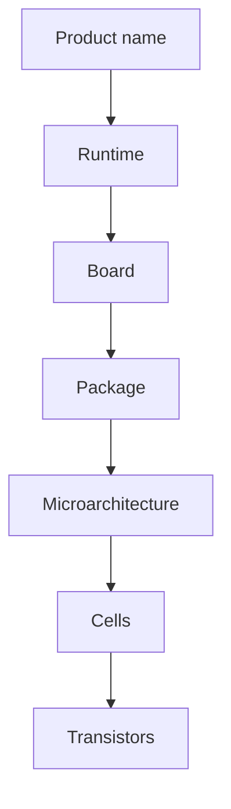

# 15 — ASIC hierarchy

```mermaid
flowchart TB
  L6[Product name] --> L5[Runtime]
  L5 --> L4[Board]
  L4 --> L3[Package]
  L3 --> L2[Microarchitecture]
  L2 --> L1[Cells]
  L1 --> L0[Transistors]
```
