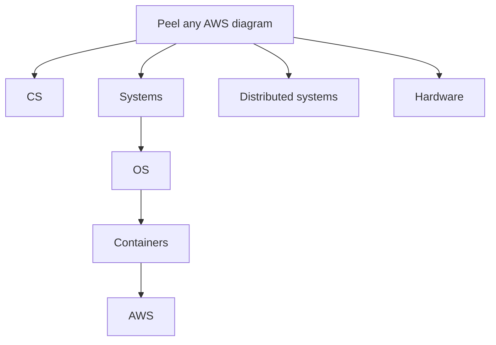

# 17 — Learning tree

```mermaid
flowchart TB
  ROOT[Peel any AWS diagram] --> CS[CS]
  ROOT --> SYS[Systems]
  ROOT --> DIST[Distributed systems]
  ROOT --> HW[Hardware]
  SYS --> OS[OS]
  OS --> CT[Containers]
  CT --> AWS[AWS]
```
