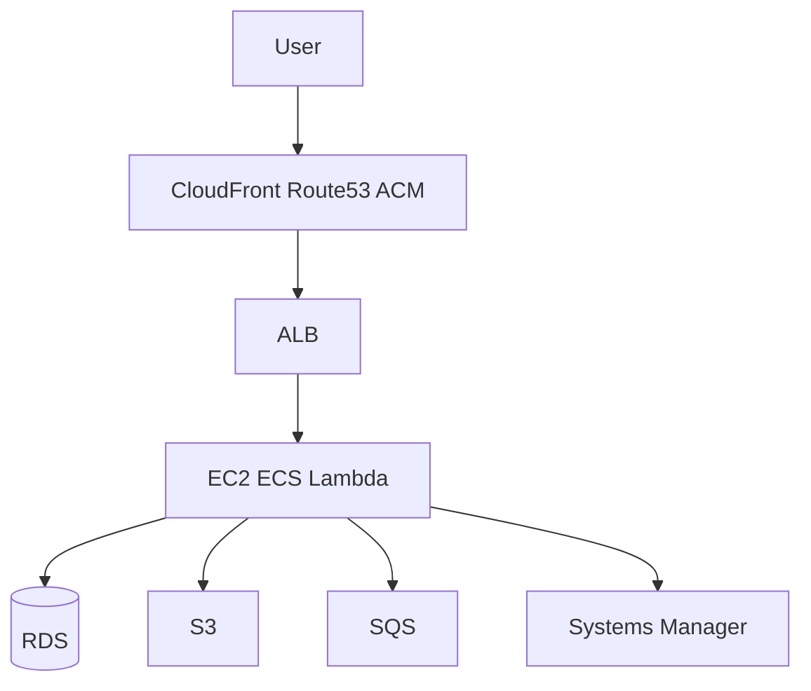

# 18 — AWS service map

```mermaid
flowchart TB
  USER[User] --> EDGE[CloudFront Route53 ACM]
  EDGE --> ENTRY[ALB]
  ENTRY --> COMPUTE[EC2 ECS Lambda]
  COMPUTE --> DATA[(RDS)]
  COMPUTE --> OBJ[S3]
  COMPUTE --> Q[SQS]
  COMPUTE --> OPS[Systems Manager]
```
