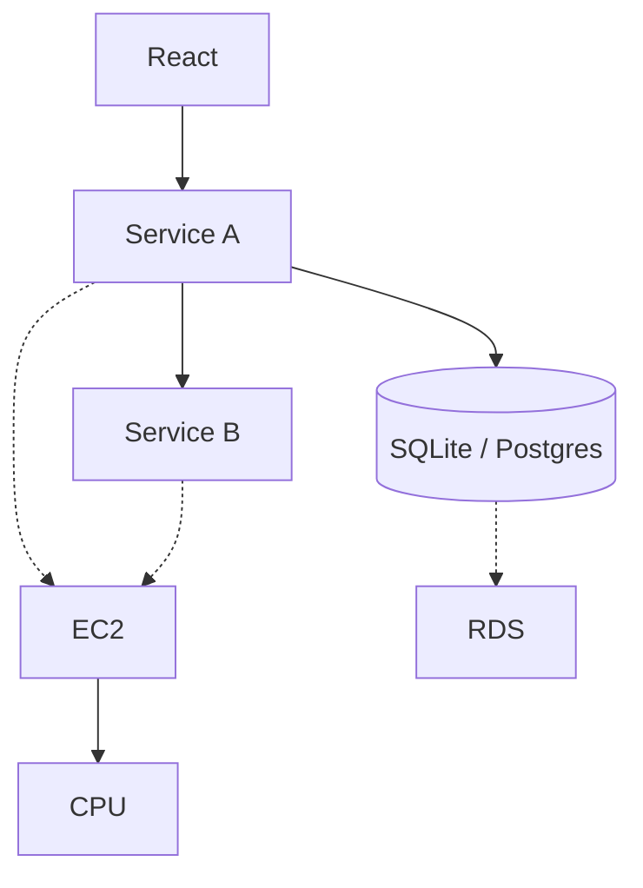

# 20 — Ultimate architecture

```mermaid
flowchart TB
  UI[React] --> A[Service A]
  A --> DB[(SQLite / Postgres)]
  A --> B[Service B]
  A -.-> EC2[EC2]
  B -.-> EC2
  DB -.-> RDS[RDS]
  EC2 --> CPU[CPU]
```
